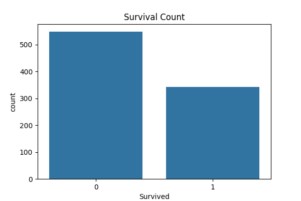
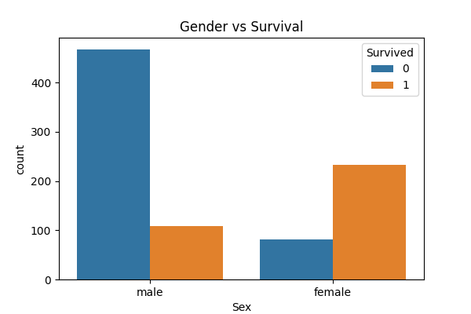
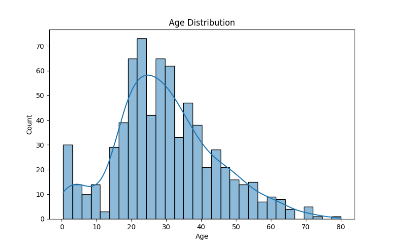
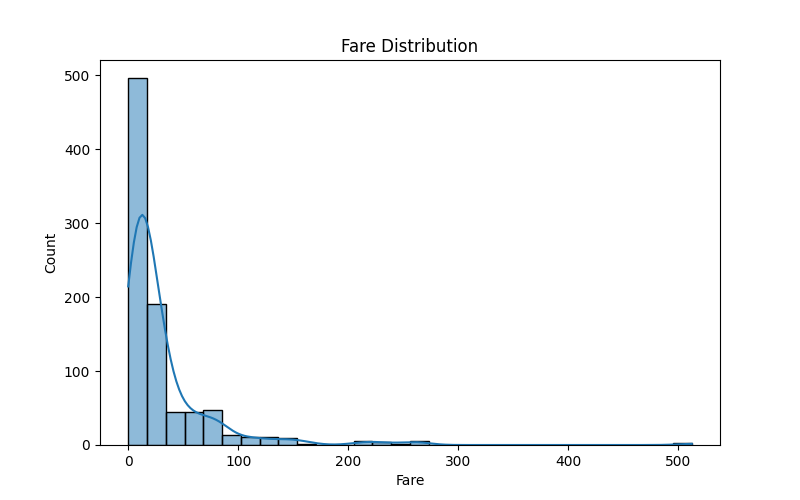
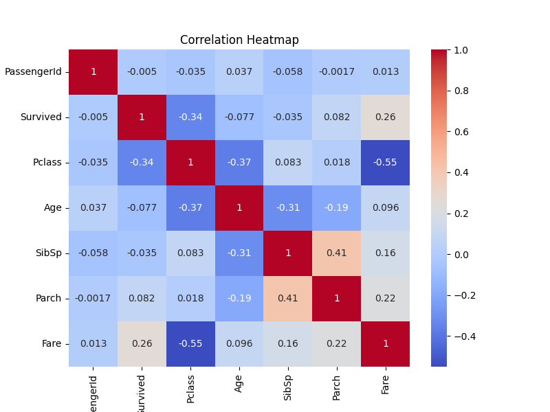

# Titanic EDA Project

This project performs data cleaning and exploratory data analysis (EDA) on the Titanic dataset.

## Features:
- Data Cleaning
- Handling Missing Values
- Survival Analysis
- Visualization using Seaborn & Matplotlib
- Correlation Heatmap

## 📊 Output Graphs

### Survival Count

### Gender vs Survival

### Passenger Class vs Survival

### Age Distribution

### Fare Distribution

### Correlation Heatmap

